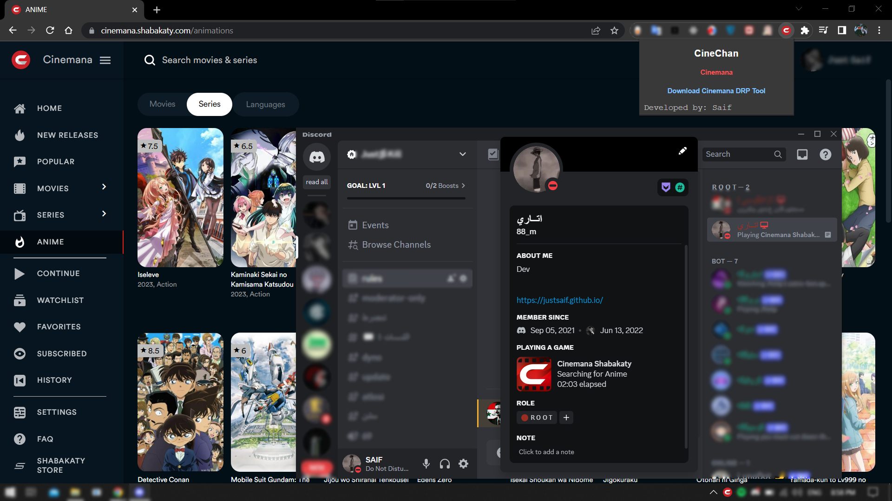

# CineChan - Cinemana Shabakaty
## About CineChan

CineChan is a 3rd party tool designed for the website ["Cinemana Shabakaty,"](https://cinemana.shabakaty.com/) a platform for streaming TV shows, movies, anime, documentaries, and more. 🎥🍿

CineChan offers a Google Chrome extension and a desktop app for Windows, enhancing your experience on Cinemana Shabakaty. 💻✨

### Features

1. Discord Rich Presence: CineChan integrates with Discord to display your current activity on Cinemana Shabakaty. Share what you're watching, searching, and browsing with your friends! 🎮📺
2. Video Downloads: With CineChan, you can conveniently download videos directly from the Cinemana Shabakaty website. ⬇️💾
3. Stay tuned for exciting updates and new features in the future! 🚀🔜

CineChan aims to provide a seamless and immersive streaming experience, allowing you to showcase your activity and enjoy downloading content from Cinemana Shabakaty. 🌟

## Release Notes / Version 2.0.0
- **Video Downloader**: CineChan now includes a built-in video downloader feature, allowing users to easily download videos from Cinemana Shabakaty and save them locally.
- **Enhanced Discord RPC**: The Discord Rich Presence functionality has been improved by upgrading the Discord RPC package and optimizing the logic.
- **Improved performance**

## CineChan Desktop App / Used Technologies 🖥️

- **ElectronJS**: Cross-platform desktop application development.
- **Node.js Packages**: The following Node.js packages are utilized:
  - `discord-rpc`: Package for integrating with Discord for Rich Presence.
  - `axios`: HTTP client for making API requests.
  - `express`: Web application framework for server-side functionality to integrate with the extension.
  - `nodejs-file-downloader`: Package for downloading files, including videos.

## How to Use/Setup CineChan

To successfully use CineChan and enjoy its features, please follow the steps below:

1. Install the CineChan Desktop App:
   - 💻 [Download the Windows installer](https://drive.google.com/file/d/1cPNUpg-hjkIh49a_cpE5ksWLlzEoT0kT/view?usp=drive_link) and run it to install the CineChan desktop app.
   - 🔧 Make sure to complete the installation process.

2. Install the CineChan Google Chrome Extension:
   - 🌐 Since the CineChan Chrome Extension is not available on the Chrome Web Store, you need to import it as an unpacked extension.
   - 📥 [Download the CineChan Chrome Extension](https://drive.google.com/file/d/1ErTauIzxdetaAqF4mJB0XRe_K8Pr3_4s/view?usp=drive_link) and extract the contents to a local folder on your computer.

   **To Install as an Unpacked Extension:**
   - Open Google Chrome and go to `chrome://extensions` in the address bar.
   - Enable the "Developer mode" toggle at the top right corner of the page.
   - Click on the "Load unpacked" button and select the folder where you extracted the CineChan Chrome Extension.
   - The extension should now be installed and ready to use.

   Note: Remember to keep the extension folder on your computer for the extension to function correctly.

Note: It is essential to install both the CineChan desktop app and the Chrome extension for CineChan to work properly. If either component is missing, the functionality may be limited or unavailable.

## - Screenshots

  
   
   
  

## Contributing

Thank you for your interest in contributing to our project! 🎉✨

We value and appreciate community contributions. To contribute, please follow these guidelines:

1. Fork the repository and clone it to your local machine.
2. Make the necessary changes and improvements.
3. Ensure that your code adheres to our coding standards and guidelines.
4. Commit your changes with clear and descriptive commit messages.
5. Push your changes to your forked repository.
6. Create a pull request, clearly describing the modifications you've made and providing any relevant information.

We hope you enjoy using CineChan and have a seamless streaming experience with Cinemana Shabakaty! 🎉🍿🎥